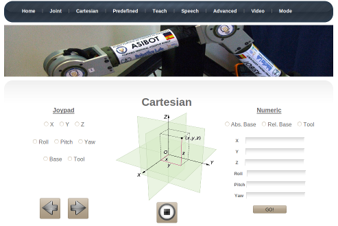

Human-machine interface applications for ASIBOT.

    

## Contributing

#### Posting Issues

1. Read [CONTRIBUTING.md](CONTRIBUTING.md)
2. [Post an issue / Feature request / Specific documentation request](https://github.com/roboticslab-uc3m/asibot-hmi/issues)

#### Fork & Pull Request

1. [Fork the repository](https://github.com/roboticslab-uc3m/asibot-hmi/fork)
2. Create your feature branch (`git checkout -b my-new-feature`) off the `master` branch, following the [Forking Git workflow](https://www.atlassian.com/git/tutorials/comparing-workflows/forking-workflow)
3. Commit your changes
4. Push to the branch (`git push origin my-new-feature`)
5. Create a new Pull Request

## Status

## Links of interest:

* [asibot-main](https://github.com/roboticslab-uc3m/asibot-main)
